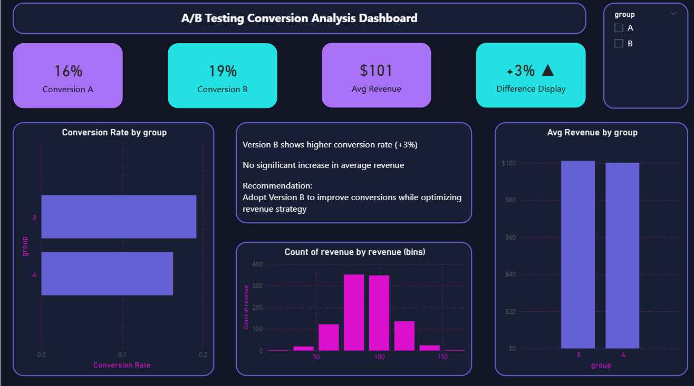

📊 Project Overview

This project analyzes an A/B testing experiment to evaluate the impact of two versions (A & B) on user conversion and revenue. The goal is to determine which version performs better and support data-driven decision-making.

🎯 Objective

To compare Version A and Version B in terms of:

Conversion Rate
Revenue Impact
Overall Business Performance
🛠️ Tools Used
Power BI (Interactive Dashboard & Data Visualization)
DAX (KPI Calculations and Measures)
Excel & Power Query (Data Cleaning and Transformation)
Python (Exploratory Data Analysis & Statistical Testing)
📈 Key Metrics
Conversion Rate (A vs B)
Conversion Lift
Average Revenue per User
🔍 Key Insights
Version B achieved a +3% increase in conversion rate
No significant change in average revenue
Improved user engagement without impacting revenue
💡 Recommendation

Adopt Version B to improve conversion performance while focusing on optimizing revenue per user through pricing or upselling strategies.

📸 Dashboard Preview

📂 Project Structure

ab-testing-conversion-analysis/
│
├── data/
│ └── ab_test_data.xlsx
│
├── dashboard/
│ └── ab_testing_dashboard.pbix
│
├── images/
│ └── dashboard.png
│
└── README.md

🚀 Outcome

Delivered an end-to-end data analysis solution combining data cleaning, statistical analysis, and interactive visualization to support business decision-making.

## 📸 Dashboard Preview

🧠 Skills Demonstrated
Data Analysis
A/B Testing
Data Visualization
Business Insight Generation
DAX & Power BI Development
Statistical Thinking
🔗 Author

Mohamed Sabri
📧 m_sabry91@hotmail.com
📱 +974-77044335
